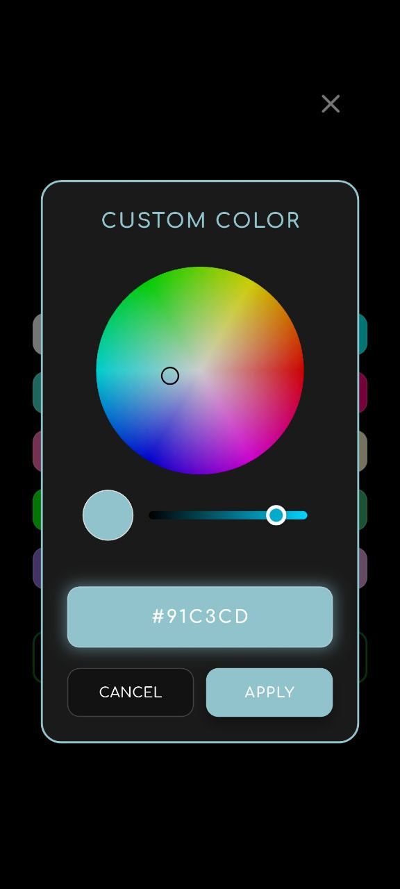

# 🕒 Focus Clock

**Your all-in-one LED desk clock replacement app — with timer, stopwatch, alarms & reminders. Built for landscape mode and always-on displays.**

[](https://flutter.dev) 
[](https://dart.dev) 
[](LICENSE)

### 📥 Download APK

**[⬇️ Download Focus Clock v1.0.0 (52 MB)](https://github.com/mehedi-hridoy/FocusClock/raw/main/Focus%20Clock.apk)**

---

## Overview

Focus Clock is your LED desk clock replacement — a full-featured Android app designed to sit on your desk or nightstand. No need for expensive LED clocks when you have an old phone or tablet.

**Why Focus Clock?**
- Replaces physical LED desk clocks
- Always-on display support
- Large, readable digits in landscape mode
- Multiple watch faces with customizable colors
- Integrated timer, stopwatch, alarms & reminders

---

## 📱 Screenshots

### 🎬 Onboarding Experience

<table>
  <tr>
    <td></td>
    <td></td>
  </tr>
  <tr>
    <td></td>
    <td></td>
  </tr>
  <tr>
    <td></td>
    <td></td>
  </tr>
</table>

### 🏠 Home Screen

<table>
  <tr>
    <td></td>
  </tr>
</table>

### 🕐 Watch Faces

<table>
  <tr>
    <td></td>
    <td></td>
  </tr>
  <tr>
    <td></td>
    <td></td>
  </tr>
</table>

### ⏱️ Timer

<table>
  <tr>
    <td></td>
    <td></td>
  </tr>
  <tr>
    <td></td>
  </tr>
</table>

### ⏲️ Stopwatch

<table>
  <tr>
    <td></td>
  </tr>
</table>

### 🔔 Alarms

<table>
  <tr>
    <td></td>
    <td></td>
  </tr>
  <tr>
    <td></td>
    <td></td>
  </tr>
  <tr>
    <td></td>
  </tr>
</table>

### 📝 Reminders

<table>
  <tr>
    <td></td>
    <td></td>
  </tr>
  <tr>
    <td></td>
    <td></td>
  </tr>
  <tr>
    <td></td>
  </tr>
</table>

### ⚙️ Settings

<table>
  <tr>
    <td></td>
  </tr>
</table>

---

## Key features (short)

- 5 watch faces (LED, segment, rounded, large-digit, flip)
- 36+ preset colors + RGB custom picker
- Timer with reversible countdown direction (60→0 or 0→60)
- Stopwatch with lap support
- Multiple alarms and reminders with repeat and ringtones
- Landscape-first, always-on display

---

## Developer notes (concise / senior-dev style)

### Contract (inputs / outputs / error modes)
- Inputs: UI gestures (tap, double-tap, long-press, swipe), settings, scheduled alarm/reminder payloads.
- Outputs: full-screen rendering, local notifications, alarm audio/vibration, persisted settings.
- Errors: permission denial, OS battery optimizations, missing audio files. App should fail gracefully and log.

### Where to look (quick map)
- Entry: `lib/main.dart`
- Screens: `lib/presentation/screens/` (clock, timer, stopwatch, alarm, reminder)
- Widgets: `lib/presentation/widgets/`
- State: `lib/state/` (`timer_provider.dart`, `settings_provider.dart`, etc.)
- Services: `lib/core/services/` (alarm_service, notification_service)
- Assets/screenshots: `docs/screenshots/`

### Run & build (commands)

Install dependencies and run on a device/emulator:

```bash
flutter pub get
flutter run -d <device-id>
```

Build release APK:

```bash
flutter clean
flutter pub get
flutter build apk --release
```

### Tests

Run unit and widget tests:

```bash
flutter test
```

Integration tests (if present): use `integration_test` and run via `flutter test` or `flutter drive` as configured.

### Release checklist
- Bump `version` / `buildNumber` in `pubspec.yaml`.
- Run `flutter build apk --release` and verify on target devices.
- Tag and push a release; attach `Focus.Clock.apk` in GitHub releases and include changelog.

Minimal release commands:

```bash
git add .
git commit -m "release: v1.0.0"
git tag -a v1.0.0 -m "Focus Clock v1.0.0"
git push origin main --tags
```

### CI suggestions (lightweight)
- `flutter format --set-exit-if-changed .`
- `flutter analyze`
- `flutter test`
- Optional: `fastlane` for Play Store automation

### Troubleshooting (common)
- App won't install: enable "Install unknown apps" and ensure selected APK matches device ABI.
- Alarms not firing: verify Exact Alarms permission and remove battery optimizations for the app.
- UI performance issues: run DevTools profiler and check main-thread work.

---

## Contributing

Please follow `CONTRIBUTING.md`. Keep PRs focused and include tests for behavior changes.

---

## License

MIT — see `LICENSE` for details.

---

Made with ❤️ using Flutter
